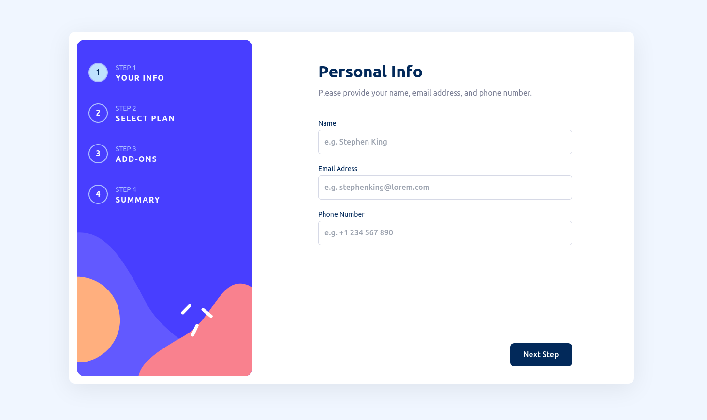
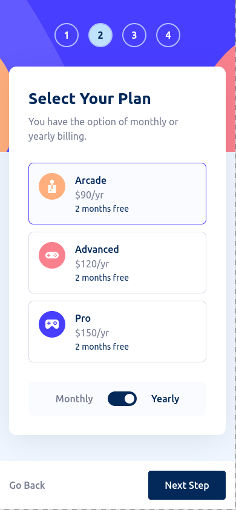

# Multi-step form

This project is a self built solution to the [Multi-step from challenge on Frontend Mentor](https://www.frontendmentor.io/challenges/multistep-form-YVAnSdqQBJ).

## Table of contents

- [Overview](#overview)
  - [The challenge](#the-challenge)
  - [Screenshot](#screenshot)
  - [Links](#links)
- [My process](#my-process)
  - [Built with](#built-with)
  - [Other libraries](#other-libraries)

## Overview

### The challenge

Users should be able to:
  - Complete each step of the sequence
  - Go back to a previous step to update their selections without loosing data
  - See a summary of their selections on the final step and confirm their order
  - View the optimal layout for the interface depending on their device's screen size
  - Receive form validation messages if:
    - A field has been missed
    - The email address is not formatted correctly
    - The phone number is not formatted correctly
  - See form data on console after submission

### Screenshot

Desktop view:

Mobile view:

### Links

- Live Site URL: [Vue Multi-Step-Form](https://vue-multi-step-form-blsr.vercel.app/)

## My process

### Built with

- [Vue.js](https://vuejs.org/) - JS framework
- [Vite](https://vitejs.dev/) - Frontend build tool
- [Pinia](https://pinia.vuejs.org/) - Vue store
- [Tailwind Css](https://tailwindcss.com/) - Css framework

### Other libraries

- [VueUse](https://vueuse.org/) - Composition utilities
- [VeeValidate](https://vee-validate.logaretm.com/v4/) - Vue,js form